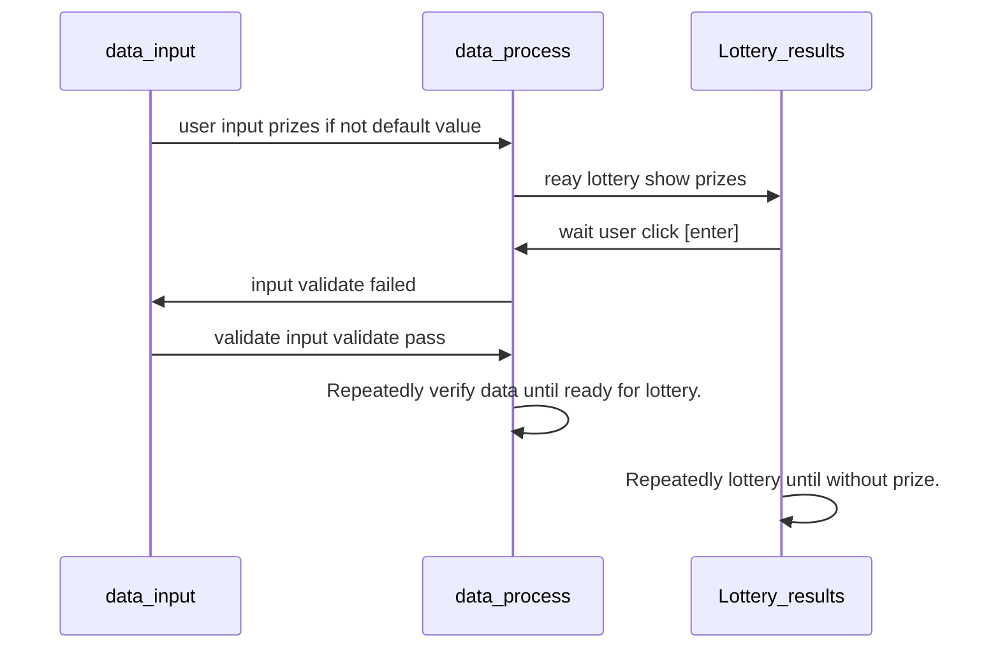

# Optional Challenge :Luckbox
- Write a program with two compilation errors, a runtime error and a logical error.
- Next to each error, add a comment that explains what type of error it is and why it occurs.
## Data Flow

