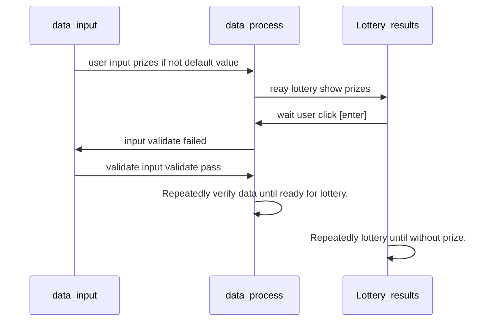

# Optional Challenge :LuckBox
- Write a program with two compilation errors, a runtime error and a logical error.
- Next to each error, add a comment that explains what type of error it is and why it occurs.
  
## LuckBox Data Work Flow

### LuckBox program Demo operation screen
  

Start Welcome Luckbox  

  

Enter How many prizes :  
How many people participating in the lottery : 13  

  

User input below 5 items prizes.  
If no input is entered,the default value will be displayed.  

  
iPhone 15 Pro  
Apple iPad 10.9  
Xbox Series X  
KODAK Mini Portable Photo Printer  
Garmin Forerunner 255 GPS Watch 

  

The draw has been prepared and the prizes and mumber of participants are displayed.  
Wait for the person to press enter to draw the prize.  

  

Press enter to draw the first prize  

  

Press enter to draw the second prize  

  

Press enter to draw the third prize  

  

Press enter to draw the fourth prize  

  

Press enter to draw the fifth prize.

### LuckBox program Demo completed.

